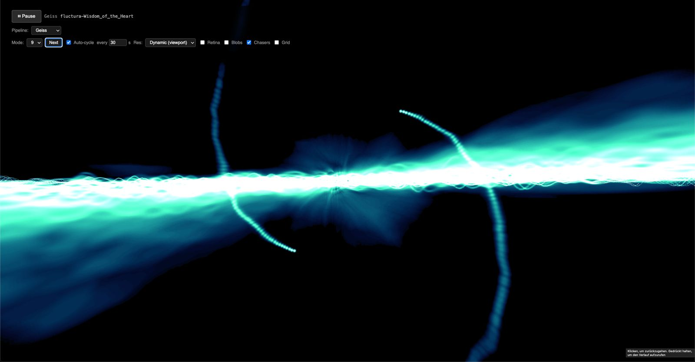
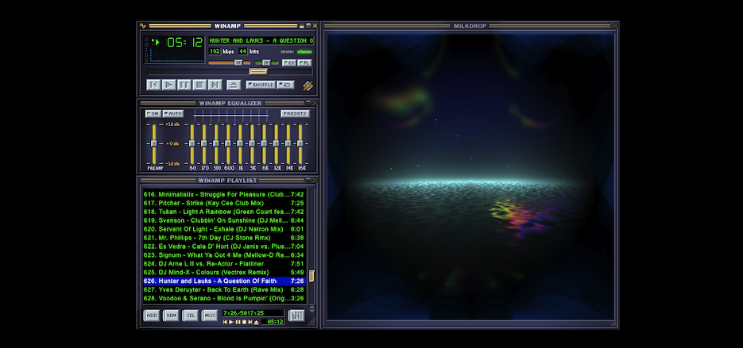

<p align="center">
  
  
</p>

<h1 align="center">Bergium</h1>

<p align="center">
  Audio visualizer engine with dual rendering pipelines -  <strong>Milkdrop</strong> (butterchurn-compatible) and <strong>Geiss</strong> (GPU feedback warp) - in pure TypeScript + WebGL2.
</p>

---

Bergium is a TypeScript 7, WebGL 2 audio-reactive rendering engine that runs fast in the browser even at 8K screen resolution (4K + retina) while preserving Butterchurn's public API contract and supporting multiple renderer pipelines(Milkdrop + Geiss) rendering to one canvas element. 

It features:

- a compatibility-oriented MilkDrop/Butterchurn pipeline;
- a ringbuf.js, JIT-optimized TypeScript port for high-performance audio transport and DSP signal processing;
- a faithful port of Geiss feedback pipeline (based on the original C++ codebase), extensible into declarative 3D scenes;
- a shared compositor for transitions, post-processing, and text (titles).

With several high performance optimizations, hand-crafted by me, and a careful port of the original Geiss C++ codebase, assisted by my AI Agent Harness. 

_Actually, this is a demo project to show the power of Agent Harness-deriven Agentic Software Engineering._

## Features

- **High-level [`BergiumPlayer`](packages/bergium/src/api/BergiumPlayer.ts) API** - One canvas, dual pipeline, click-to-toggle, 30s mode/preset cycling, song-title overlays, and a built-in preset registry — all internal, so demos stay tiny
- **Webamp integration** - Drop-in bergium visualizer for Webamp via `webamp/butterchurn` (see [`apps/webamp-demo`](apps/webamp-demo/README.md))
- **1000+ Milkdrop presets** - [`getBuiltinPresets()`](packages/bergium/src/presets/builtin/index.ts) merges bergium-authored presets with the `butterchurn-presets` library, filtering known-broken ones
- **9 Geiss modes** - Auto-cycling with configurable interval (default 30s), or manual selection
- **Geiss Audio effects** - ShadeBobs, Chasers, and Grid effects with per-effect toggles
- **Configurable resolution** - Fixed (640x480 / 960x720 / 1280x960), Dynamic (viewport), or Retina (xDPR)
- **Song title overlay** - Pipeline-agnostic `launchSongTitleAnim()` with fade in/out
- **Pipeline switching** - Switch live between Milkdrop and Geiss at runtime (canvas click or API)

## Quick Start

### Standalone demo (`apps/demo`)

```bash
# Install dependencies
bun install

# Build the core package
bun run build:bergium

# Start the demo (Vite dev server on http://localhost:5173)
bun run dev:demo
```

Then open `http://localhost:5173`, click **Play**, and use the toggle/preset
controls (or click the canvas) to switch Geiss/Milkdrop.

### Webamp demo (`apps/webamp-demo`)

Plays the Archive.org **Trancemaster** playlist in Webamp, with bergium as the
visualizer (click the visualizer window to toggle Geiss/Milkdrop). Requires
building the webamp fork bundles once — see
[`apps/webamp-demo/README.md`](apps/webamp-demo/README.md):

```bash
bun run build:webamp-bergium   # bergium-core + the webamp fork bundles
bun run dev:webamp-demo        # http://localhost:5174
```

(Or build everything — bergium, the fork, and both demos — with `bun run build:all`.)

## API

### High-level: [`BergiumPlayer`](packages/bergium/src/api/BergiumPlayer.ts) (recommended)

Owns both pipelines on one canvas, click-to-toggle, 30s mode/preset cycling,
song-title overlays, and the built-in preset registry — so demos/integrations
stay tiny.

```typescript
import { createBergiumPlayer } from "bergium-core";

const player = createBergiumPlayer(audioContext, canvas, {
  initialPipeline: "milkdrop", // or "geiss"
  geiss: { effects: { chasers: true }, cycleSeconds: 30 },
  milkdrop: { cycleSeconds: 30 },
});

player.connectAudio(analyserNode);
// autoRender defaults to true (own RAF loop). Click the canvas to toggle pipelines.
player.launchSongTitleAnim("Artist - Track");
```

`BergiumPlayer` implements the small butterchurn-compatible surface Webamp drives
(`connectAudio` / `loadPreset` / `setRendererSize` / `launchSongTitleAnim` /
`render`), so Webamp's `webamp/butterchurn` entry injects it directly — see
[`apps/webamp-demo`](apps/webamp-demo/README.md).

### Low-level: [`createVisualizer`](packages/bergium/src/api/createVisualizer.ts)

For full control (manual preset/mode/effect wiring), use the factory directly:

```typescript
import { createVisualizer, GeissAdapter } from "bergium-core";

const viz = createVisualizer(audioContext, canvas, {
  pipeline: "milkdrop", // or "geiss"
  width: 1280,
  height: 720,
});

viz.connectAudio(analyserNode);
viz.loadPreset(presetObject, 0.5); // Milkdrop

if (viz instanceof GeissAdapter) {
  viz.setMode(3);                 // Geiss
  viz.setAutoMode(true);
  viz.setAutoCycleSeconds(30);
  viz.setEffect("shadeBobs", true);
}

viz.launchSongTitleAnim("Artist - Track");
viz.render();
```

## Acknowledgement: Jordan Berg

Bergium builds upon the work of **Jordan Berg**, creator and principal developer of **Butterchurn**, the WebGL implementation of the MilkDrop visualizer. Butterchurn demonstrated that MilkDrop's feedback textures, preset system, waveform rendering, programmable shaders, and audio-reactive behavior could be reproduced faithfully and efficiently in modern browsers.

Bergium preserves Butterchurn's established integration model and public API while restructuring the implementation around typed renderer pipelines, deterministic timing, shared audio processing, explicit render targets, and a common compositor.

Code derived from Butterchurn retains its applicable copyright attribution and MIT license notice. Bergium is an independent project and does not imply Jordan Berg's participation, affiliation, or endorsement.

* Butterchurn: [github.com/jberg/butterchurn](https://github.com/jberg/butterchurn)
* Butterchurn website: [butterchurnviz.com](https://butterchurnviz.com/)

## Shared audio-processing foundation

Bergium's common high-performance audio path builds upon **ringbuf.js**, originally created by **Paul Adenot** for efficient communication between real-time audio and application threads.

In 2025, I, **Aron Homberg** contributed the upstream modernization of ringbuf.js from JavaScript to TypeScript. This work included updated tooling and types, JIT-oriented loop and memory-copy optimizations, unrolled processing paths, and dedicated benchmarks for copy and deinterleaving performance.

Bergium uses this work as the shared transport layer between `AudioWorklet`, audio analysis, and its renderer pipelines. MilkDrop-compatible and feedback-based renderers therefore consume the same timestamped, normalized audio frames without duplicating browser audio handling or introducing allocations into the real-time callback.

* ringbuf.js: [github.com/padenot/ringbuf.js](https://github.com/padenot/ringbuf.js)
* TypeScript and performance modernization: [commit d55cb9a](https://github.com/padenot/ringbuf.js/commit/d55cb9a5d3ad84933cc9e7a84da5b558e75a90e8)

## The name "Bergium"

The name **Bergium** combines **Berg** with the chemical-element suffix **-ium**.

"Berg" is derived from the surname of project creator **Aron Homberg**. It also provides a deliberate secondary acknowledgement of **Jordan Berg**, whose Butterchurn implementation forms Bergium's browser-rendering foundation.

The suffix "-ium" presents Bergium metaphorically as a new technical element: a reusable foundation combining high-performance audio transport, audio analysis, feedback rendering, multiple visualization pipelines, compositing, text rendering, and declarative presets.

The name consequently represents a real continuity of contributions:

> **Geiss established the visual principles. Berg brought them to the modern browser. Homberg contributed the shared high-performance audio foundation and unified both lineages into Bergium.**

Neither the project name nor these acknowledgements imply endorsement or official involvement by Ryan Geiss, Jordan Berg, or Paul Adenot.

## Acknowledgement: Ryan Geiss

Bergium exists because of the pioneering work of **Ryan M. Geiss**, creator of **Geiss** and **MilkDrop**. Ryan established and refined the recursive feedback-warp rendering techniques, audio-reactive waveform integration, transformation maps, palette dynamics, interpolation behavior, and visual principles that inspired Bergium's classic feedback-rendering pipeline.

The implementation is informed by Ryan's published technical explanation, *How Geiss Worked*, and the openly released Geiss source code. All directly adapted or ported code retains its applicable copyright attribution and BSD-3-Clause license notice.

Bergium is an independent project and is neither an official successor to nor affiliated with or endorsed by Ryan Geiss. The project name deliberately does not use his surname; his contribution is honored through explicit technical attribution, source provenance, and preservation of the history behind these algorithms.

* Ryan Geiss: [geisswerks.com](https://www.geisswerks.com/)
* Geiss source code: [github.com/geissomatik/geiss](https://github.com/geissomatik/geiss)
* Technical history: [How Geiss Worked](https://www.geisswerks.com/geiss/secrets.html)

<p align="center">
  <a href="LICENSE">MIT License</a>
</p>
